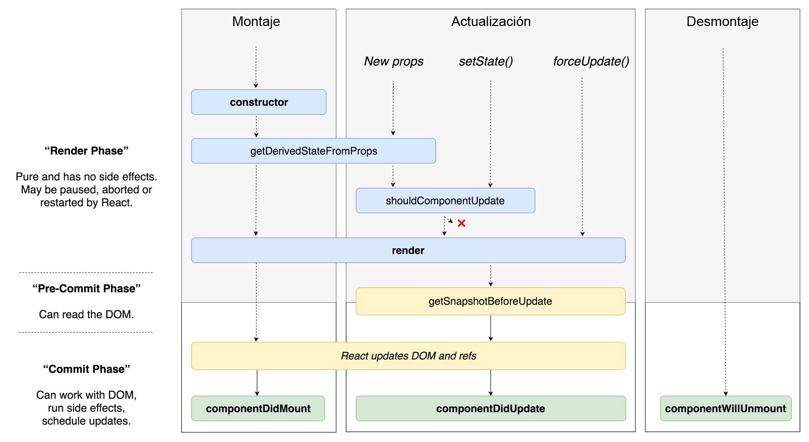

# Ciclo de Vida de React



## Fases principales

### Montaje
1. contructor
2. render
3. componentDidMount

### Actualizacion
1. render
2. componentDidUpdate

### Desmontaje
3. componentWillUnmount

## Clase utilizando ciclo de vida
```js
import React, { Component } from 'react';

class Home extends Component {
    constructor(props) {
        super(props);
        this.state = {
            data: [],
        };
    }

    componentDidMount() {
        axios('http://api.cl/users')
        .then(response => {
            /*
            El servicio retornara en data
            [{ id: 1, name: 'Claudio' }, { id: 2, name: 'Esteban' }]
            */
            this.setState({
                data: response.data,
            });
            localStorage.setItem('data', response.data);
        })
    }

    componentDidUpdate() {
        console.log('El componente se ha actualizado');
    }

    componentWillUnmount() {
        localStorage.setItem('data', null);
    }

    render() {
        return (
            <ul>
                {this.state.data(item => (
                    <li key={item.key}>
                        {item.name}
                    <li>
                ))}
            </ul>
        );
    }
}

export default Home;
```